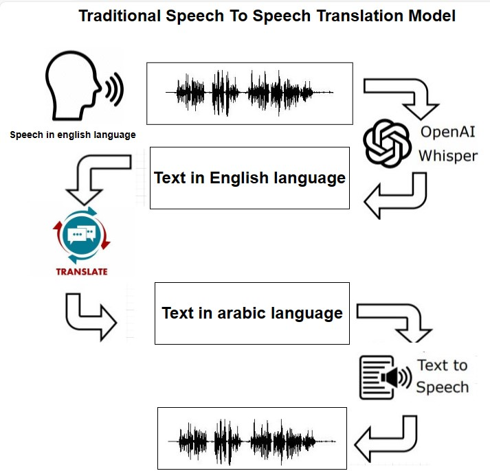

# SPEECH2SPEECH TRANSLATION 
 - Speech-to-speech translation (S2ST) aims at converting speech from one language into speech in    
   another.

## Details
 - S2ST is implemented using cascaded approaches, such as  automatic speech recognition (ASR) to  
   convert spoken words into text, machine translation (MT) to translate the text, and text-to-speech (TTS) synthesis to convert the translated text back into  speech. 

### AI Models
- segmentation model (pyannote)
- automatic speech recognition (Whisper)
- machine translation (Marefa)
- text to speech (VALL-E-X)

## Framework 
- Django
- Restful API Framework

### Running

  

